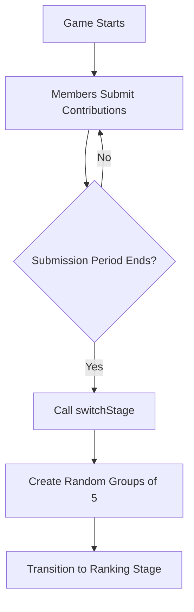
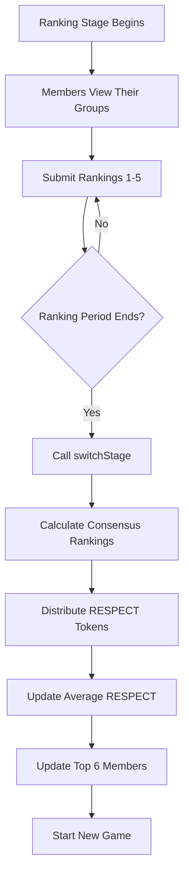

# Respect Game Smart Contracts

A decentralized governance system for the Base community that rewards contributions through a weekly respect game using RESPECT tokens (ERC-20).

## Table of Contents

- [Overview](#overview)
- [Architecture](#architecture)
- [Game Flow](#game-flow)
- [Smart Contracts](#smart-contracts)
- [Deployment](#deployment)
- [Usage](#usage)
- [Testing](#testing)
- [Security Considerations](#security-considerations)

## Overview

The Respect Game is a weekly reputation system where:

- **6 days**: Contribution submission stage
- **1 day**: Contribution ranking stage
- Members submit contributions to the Base community
- Members are grouped into teams of 5 to rank each other's contributions
- Rankings determine RESPECT token distribution
- Average RESPECT is calculated over the last 12 weeks

### Initial Parameters

| Parameter                | Value                                 | Description                                  |
| ------------------------ | ------------------------------------- | -------------------------------------------- |
| Members without approval | 10                                    | First N members can join without voting      |
| Periods for average      | 12                                    | Number of games to calculate average RESPECT |
| RESPECT distribution     | [210000, 130000, 80000, 50000, 30000] | Tokens awarded for ranks 1-5                 |
| Submission length        | 10 minutes                            | Duration of contribution submission stage    |
| Ranking length           | 10 minutes                            | Duration of ranking stage                    |

## Architecture

The system follows the UUPS (Universal Upgradeable Proxy Standard) pattern with separated concerns:

```
RespectGame System
├── RespectToken.sol (ERC-20 Token)
│   └── Upgradeable RESPECT token with minter roles
├── RespectGameStorage.sol (Storage Layer)
│   └── All state variables and structs
├── IRespectGame.sol (Interface)
│   └── Function signatures and events
└── RespectGameImplementation.sol (Logic)
    └── Core game mechanics
```

### Key Components

1. **Storage Contract** (`RespectGameStorage.sol`)

   - Enums: Stage, ProposalType, ProposalStatus
   - Structs: Member, Contribution, Group, Ranking, GameResult, Proposal
   - State variables for game management

2. **Interface** (`IRespectGame.sol`)

   - Function signatures
   - Events for all major actions

3. **Implementation** (`RespectGameImplementation.sol`)

   - Member registration and approval
   - Contribution submission
   - Ranking submission
   - Stage management and transitions
   - Group creation using Fisher-Yates shuffle
   - RESPECT distribution using shared consensus algorithm
   - Proposal system (ban, approve, treasury)

4. **Token** (`RespectToken.sol`)
   - Standard ERC-20 with minting capability
   - Role-based access control

## Game Flow

### Phase 1: Contribution Submission



1. Members submit their contributions with links
2. Anyone can submit, but only approved members are counted
3. Stage automatically switches after time expires

### Phase 2: Contribution Ranking



1. Members are randomly assigned to groups of 5
2. Each member ranks their group members from 1st to 5th
3. Consensus algorithm determines final rankings
4. RESPECT tokens are distributed
5. Average RESPECT is recalculated

### Consensus Algorithm

The system uses a position-based scoring system:

- Each ranking assigns scores: 1st place = 1, 2nd = 2, ..., 5th = 5
- Scores are accumulated across all rankers
- Members are sorted by total score (lower is better)
- RESPECT is distributed based on final positions

## Smart Contracts

### RespectGameImplementation.sol

#### Member Functions

**`becomeMember(name, profileUrl, description, xAccount)`**

- Register as a new member
- First 10 members auto-approved
- Subsequent members need proposal approval

**`approveMemberProposal(proposalIndex)`**

- Approve a pending member (executed by proposal)

#### Contribution Functions

**`submitContribution(contributions[], links[])`**

- Submit contributions for current game
- Must be during submission stage
- Only approved members get counted

#### Ranking Functions

**`submitRanking(rankedAddresses[5])`**

- Submit rankings for your group
- Must be during ranking stage
- All addresses must be from your group
- No duplicates allowed

#### Stage Management

**`switchStage()`**

- Transition between stages
- Can be called multiple times for batch processing
- Handles grouping, ranking calculation, and distribution

#### Proposal Functions

**`createBanProposal(targetMember, description)`**

- Top 6 members can create ban proposals
- Requires 3 votes to execute

**`createApproveMemberProposal(targetMember, description)`**

- Top 6 members can approve new members
- Requires 2 votes to execute

**`createTreasuryTransferProposal(recipient, amount, description)`**

- Top 6 members can propose treasury transfers
- Requires 4 votes to execute

**`voteOnProposal(proposalId, voteFor)`**

- Top 6 members can vote
- Auto-executes when threshold reached

### RespectToken.sol

Standard ERC-20 token with:

- Minting capability (restricted to authorized contracts)
- Burning capability
- Upgradeable via UUPS pattern

## Deployment

### Prerequisites

```bash
cd blockchain
npm install
```

### Deploy to Local Network

```bash
npx hardhat node

# In another terminal
npx hardhat run scripts/respect-game.deploy.ts --network localhost
```

### Deploy to Base Sepolia

```bash
npx hardhat run scripts/respect-game.deploy.ts --network base-sepolia
```

### Deploy to Base Mainnet

```bash
npx hardhat run scripts/respect-game.deploy.ts --network base-mainnet
```

### Post-Deployment

The deployment script automatically:

1. Deploys RespectToken
2. Deploys RespectGame
3. Configures RespectGame as token minter
4. Outputs all contract addresses

## Usage

### For Members

#### Join the Game

```solidity
respectGame.becomeMember(
    "Alice",
    "https://alice.com",
    "Core contributor",
    "@alice"
);
```

#### Submit Contributions

```solidity
string[] memory contributions = ["Built feature X", "Fixed bug Y"];
string[] memory links = ["https://github.com/pr/1", "https://github.com/pr/2"];

respectGame.submitContribution(contributions, links);
```

#### Get Your Group

```solidity
(address[5] memory group, uint256 groupId) = respectGame.getMyGroup(gameNumber);
```

#### Submit Rankings

```solidity
address[5] memory rankings = [
    address1, // 1st place
    address2, // 2nd place
    address3, // 3rd place
    address4, // 4th place
    address5  // 5th place
];

respectGame.submitRanking(rankings);
```

### For Operators

#### Switch Stages

```solidity
// Call after stage duration expires
respectGame.switchStage();

// May need to call multiple times if many members
// (batch processing for gas optimization)
```

### For Top 6 Members

#### Create Proposals

```solidity
// Ban a member
respectGame.createBanProposal(
    memberAddress,
    "Spam and abuse"
);

// Approve a new member
respectGame.createApproveMemberProposal(
    candidateAddress,
    "Valuable contributor"
);

// Treasury transfer
respectGame.createTreasuryTransferProposal(
    recipientAddress,
    1000000,
    "Development grant"
);
```

#### Vote on Proposals

```solidity
respectGame.voteOnProposal(proposalId, true);  // Vote for
respectGame.voteOnProposal(proposalId, false); // Vote against
```

## Testing

Run the comprehensive test suite:

```bash
cd blockchain
npx hardhat test test/RespectGame.test.ts
```

### Test Coverage

The test suite includes:

- ✅ Deployment and initialization
- ✅ Member registration (with and without approval)
- ✅ Contribution submission
- ✅ Stage switching and grouping
- ✅ Ranking submission and validation
- ✅ RESPECT distribution
- ✅ Average RESPECT calculation
- ✅ Proposal creation and voting
- ✅ Ban/approve member functionality
- ✅ View functions

## Security Considerations

### Access Control

1. **Owner Functions**: Only contract owner can authorize upgrades
2. **Member Functions**: Open to all, with approval logic
3. **Top 6 Functions**: Restricted to highest average RESPECT holders
4. **Minting**: Only RespectGame contract can mint RESPECT tokens

### Randomness

- Uses `block.prevrandao` (post-merge randomness source)
- Combined with timestamp, block number, and sender
- Fisher-Yates shuffle for fair group distribution
- **Note**: Not suitable for high-stakes scenarios requiring verifiable randomness (consider Chainlink VRF for production)

### Time-Based Logic

- Uses block timestamps for stage transitions
- Susceptible to minor miner manipulation (~15 seconds)
- Acceptable for week-long cycles

### Gas Optimization

- Batch processing in `switchStage()` for large member sets
- Processes up to 50 members per call for grouping
- Processes up to 10 groups per call for ranking calculation

### Upgradeability

- UUPS pattern allows contract upgrades
- Storage layout must be maintained between versions
- Owner-only upgrade authorization

## API Reference

### View Functions

```solidity
// Member information
function getMember(address) returns (
    address wallet,
    string name,
    string profileUrl,
    string description,
    string xAccount,
    bool isApproved,
    bool isBanned,
    uint256 totalRespectEarned,
    uint256 averageRespect
);

// Game state
function getCurrentStage() returns (uint8);
function getNextStageTimestamp() returns (uint256);
function currentGameNumber() returns (uint256);

// Groups
function getGroup(uint256 gameNumber, uint256 groupId) returns (address[5]);
function getMyGroup(uint256 gameNumber) returns (address[5], uint256);

// Results
function getGameResult(uint256 gameNumber, address member)
    returns (uint256 rank, uint256 respectEarned);

// Governance
function getTopMembers() returns (address[6]);
function isTopMember(address) returns (bool);
function getProposal(uint256 proposalId) returns (...);
```

### Events

All major actions emit events:

- `MemberJoined`, `MemberApproved`, `MemberBanned`
- `ContributionSubmitted`
- `RankingSubmitted`
- `GroupsCreated`, `GroupAssigned`
- `StageChanged`, `GameCompleted`
- `RespectDistributed`
- `ProposalCreated`, `ProposalVoted`, `ProposalExecuted`
- `TopMembersUpdated`

## Future Enhancements

Potential improvements for future versions:

1. **Verifiable Randomness**: Integrate Chainlink VRF for provable fairness
2. **Reputation NFTs**: Issue NFTs for milestone achievements
3. **Delegation**: Allow members to delegate their ranking votes
4. **Multi-token Support**: Accept multiple tokens for treasury
5. **Advanced Analytics**: On-chain metrics and leaderboards
6. **Dispute Resolution**: Challenge system for unfair rankings
7. **Weighted Voting**: Scale proposal votes by average RESPECT
8. **Contribution Categories**: Different RESPECT pools per category

## License

MIT

## Support

For issues, questions, or contributions:

- GitHub Issues: [Link to repo]
- Discord: [Link to community]
- Documentation: [Link to docs]

---

Built with ❤️ for the Base community
